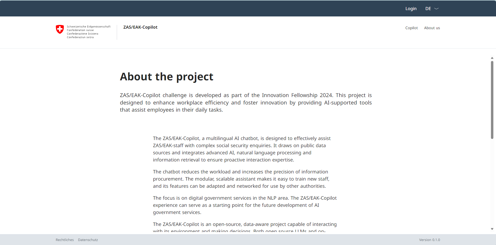

# EAK-Copilot

This is the frontend for the project [ZAS/EAK-Copilot](https://github.com/CdC-SI/eak-copilot), based on the project [ChatGPT Minimal](https://github.com/blrchen/chatgpt-minimal).

## Current design

## Features

This frontend is an lightweight app built using Next.js.

Components:
- Next.js v13
- API Routes
- Chatbot UI with React and Ant Design

## Deployment

Visit [ZAS/EAK-Copilot](https://github.com/CdC-SI/eak-copilot) and its [documentation](https://cdc-si.github.io/eak-copilot/) for full explanation. 

## Frontend Development

### Running Locally

1. Install NodeJS 18.
2. Clone the repository.
3. Install dependencies with `npm install`.
4. Start the application using `npm run dev`.
5. Visit `http://localhost:3000` in your browser.

### Running Locally with Docker

1. Clone the repository and navigate to the root directory.
2. Build the application using `docker-compose build .`.
3. Start the application by running `docker-compose up -d`.